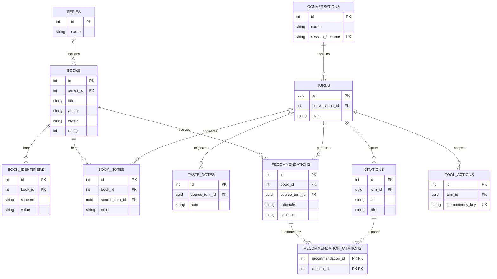

# Book Explorer Design

**Status:** Draft

## Purpose

Book Explorer is a single-user local web application for the kind of iterative book-recommendation discussion demonstrated in the “Frontlines RPG Potential” ChatGPT conversation. It preserves reading history, recommendations, nuanced reactions, and approved taste observations across conversations while using a hosted model and live web research.

The first version proves one thing: a local application can provide a ChatGPT-like recommendation conversation while reliably retaining the user's book history and preferences.

## Goals

- Run as a lightweight local website, not a hosted service.
- Support multiple named conversations sharing one library and taste profile.
- Reuse the user's existing Pi Codex OAuth authentication.
- Search the live web and retain citations for recommendation claims.
- Track works, series, recommendation history, reading state, optional 1–5 ratings, and nuanced notes.
- Let the assistant create recommendations automatically while requiring approval for anything that claims to represent the user's opinion.
- Keep book-domain state in local SQLite and conversation history in Pi's native JSONL sessions under Book Explorer's private data directory.

## Non-goals for Version 1

- General-purpose assistant behavior.
- A hosted site, user accounts, remote access, or multi-user support.
- S3 synchronization or backup.
- Edition, format, ownership, lending, Libby, Hoopla, or Kindle Unlimited tracking.
- Goodreads or StoryGraph import before their exports have been evaluated.
- Embeddings, vector search, collaborative filtering, learned ranking, or graph visualization.
- Autonomous background work, messaging channels, scheduling, or NanoClaw integration.
- Mobile-specific UI work.

## Architecture

One Node 24 LTS TypeScript process binds to `127.0.0.1` and serves the browser application and its API. Version 1 requires Node 24.15 or newer so `node:sqlite` has its release-candidate API. The project records its Node version and exact dependency versions in source control; `node:sqlite` access is confined to the database module because the API has not reached stable status.

The process uses:

- `@earendil-works/pi-coding-agent@0.84.2` for the agent loop, streaming, compaction, model selection, and OAuth-backed Codex access.
- `pi-web-access@0.24.2` as an explicitly loaded Pi extension, pinned by the project lockfile, for Codex-backed `web_search` and returned citations. This version's `openai-search.ts` resolves `openai-codex` credentials through Pi's model registry.
- Node's `node:http` server and server-sent events for response streaming.
- Node's synchronous `DatabaseSync` API from `node:sqlite` for persistence.
- Static HTML, CSS, and browser JavaScript with no frontend framework or frontend bundler.
- TypeScript compiled to ESM JavaScript with `tsc` before execution.
- Node's built-in test runner.

Application data lives under `$XDG_DATA_HOME/book-explorer/` or `~/.local/share/book-explorer/` when `XDG_DATA_HOME` is unset. On POSIX, startup creates and verifies the application directory as mode `0700` and the database, JSONL sessions, configuration, and cache files as `0600`; unsafe permissions fail startup with a corrective message. On Windows, files remain under the current user's profile and inherit its ACL, with a warning if the directory is broadly accessible.

SQLite is authoritative for books and related application state. Pi's native JSONL format is authoritative for conversation history. Each conversation owns one session file in Book Explorer's dedicated `sessions/` directory. SQLite stores only its generated relative filename and display metadata; paths are resolved and boundary-checked beneath that directory before opening.

For a new conversation, the application uses `SessionManager.create(appCwd, appSessionDir)`. For an existing conversation, it uses `SessionManager.open(checkedSessionPath, appSessionDir, appCwd)`. A Pi `AgentSession` and fresh resource loader exist only for one model turn, but the passed `SessionManager` writes messages, tool results, custom entries, failures, and compactions directly to that conversation's JSONL file. The UI reads the active branch through the SessionManager APIs. Book Explorer does not duplicate messages in SQLite or reimplement Pi restoration, compaction, or session-entry migration. Images and user-visible branching are not supported in version 1.

The application awaits `ModelRuntime.create` with `authPath` explicitly set to Pi's existing `~/.pi/agent/auth.json`, `modelsPath` set to an application-local file, and `modelsStorePath` set under Book Explorer's data directory. At startup it resolves the conversational model explicitly as `openai-codex/gpt-5.6-sol` with medium thinking and fails closed if that model or OAuth credential is unavailable. It passes that exact model and runtime instance to every agent session and guard. `agentDir`, `SettingsManager`, extension configuration, model cache, sessions, and all other application paths also remain under Book Explorer's data directory. Setting an application-specific `agentDir` alone is insufficient and must not be used as the authentication mechanism.

Each model turn constructs a fresh `DefaultResourceLoader` configured with `noExtensions`, `noSkills`, and `noContextFiles`, `systemPromptOverride: () => completePrompt`, and `appendSystemPromptOverride: () => []`, then awaits `loader.reload()` before session creation. The project-local `pi-web-access` extension entry point is the only `additionalExtensionPaths` entry. A loader is never reused after its session is disposed because disposal invalidates that loader's extension runtime; a fresh loader creates a fresh runtime while the cached extension module remains process-wide. Seven application tools are registered through `customTools`; an inline `extensionFactories` guard handles the `tool_call` event and blocks forbidden search parameters. `createAgentSession` uses `noTools: "builtin"` and an explicit allowlist containing those seven tools plus `web_search`:

- `search_library`
- `get_book`
- `upsert_book`
- `upsert_series`
- `record_recommendation`
- `propose_change`
- `get_taste_profile`
- `web_search`

These constants are the complete `tools` allowlist. The application-local web-search config must exist and validate before loader creation. After `loader.reload()` and session creation, every turn inspects the active `session.agent.state.tools` names before prompting and fails closed if the allowlist was omitted or any unexpected registered tool survived filtering. A startup probe uses and disposes its own loader rather than the first turn's loader. Coding, shell, filesystem editing, subagent, page-fetching, curator UI, and other Pi or `pi-web-access` tools are disabled.

The application-local `web-search.json` sets `provider: "openai"`, `workflow: "none"`, and nested `tools.sourceCheck.enabled`, `tools.fetchContent.enabled`, and `tools.getSearchContent.enabled` to `false`. The headless extension runner is never bound to Pi dialog/TUI services, so curator mode remains unavailable. A small inline guard extension requires `provider: "openai"` and `workflow: "none"`, blocks `includeContent`, and rejects provider arrays. Before allowing the call, it uses the exact `ModelRuntime` passed to the session to verify an `openai-codex` model and OAuth credential; API-key and environment fallbacks do not satisfy this check. Otherwise it returns a visible search-unavailable error instead of letting `pi-web-access` choose a fallback. `PI_CODING_AGENT_DIR` is set before importing the extension, causing `pi-web-access@0.24.2` to place its configuration and any on-disk fetch cache under Book Explorer's application directory rather than the user's general Pi directory. `pi-web-access` module state is process-wide even though each agent session is ephemeral. Book Explorer therefore permits only one model turn globally, avoiding cross-conversation mutation of that extension state. Each complete search result is consumed during its turn and durable citations are recorded in SQLite. The application clears any stale `web-search-cache` directory at startup, and the guarded search path must not write to it.

Pi's credential storage uses a cross-process file lock during OAuth refresh and mutation. Concurrent coding and Book Explorer sessions therefore do not share conversation state or corrupt credentials because both runtimes open the same auth path. They can still compete for account-level subscription rate and concurrency limits; the UI reports those errors directly.

## Data Model

SQLite enables foreign keys and WAL mode. The process owns one `DatabaseSync` handle. Every database operation and transaction is synchronous and contains no awaited work, so Node's event loop serializes writes from concurrent conversations; network calls occur outside transactions. Numbered migrations run transactionally at startup. A failed migration prevents startup rather than opening a partially migrated database.

### Core records

- `conversations`: name, generated relative Pi session filename, timestamps, and archival state.
- `turns`: stable UUID, conversation, optional Pi user/assistant entry IDs, state (`pending`, `complete`, `failed`, or `cancelled`), and timestamps. This supplies idempotency and recovery metadata without duplicating message content.
- `series`: canonical name and optional descriptive note.
- `books`: title, author text, publication year, cover URL, optional series and series position, reading status, optional integer rating from 1 through 5, and timestamps.
- `book_identifiers`: book, scheme (`openlibrary_work`, `isbn10`, or `isbn13`), normalized value, and source. A book may have many identifiers; `(scheme, value)` is unique.
- `book_notes`: book, note text, optional source turn, and timestamp. Notes are append-only by default so changes in opinion remain visible; the user can edit or delete them explicitly.
- `recommendations`: book, source turn, rationale, cautions, and timestamp.
- `citations`: source turn, normalized URL, title, supporting snippet when available, observed search provider, and retrieval timestamp. `(turn_id, normalized_url)` is unique.
- `recommendation_citations`: recommendation and citation foreign keys identifying which researched sources support a recommendation.
- `taste_notes`: approved free-text preference observation, optional source turn, and timestamp.
- `tool_actions`: turn, idempotency key, action state, and serialized result containing the affected entity type and ID. The key and result are committed in the same transaction as the action so retries can return the original result.

Proposed ratings, statuses, book opinions, and taste notes are not SQLite records. `propose_change` appends a Pi custom entry with `customType: "book-explorer-proposed-change"`, a deterministic proposal ID, kind, optional target book, validated payload, explanation, and source turn. Accepting or rejecting appends a `book-explorer-proposal-decision` custom entry. Acceptance also validates the possibly edited payload and transactionally updates `books` or inserts `book_notes`/`taste_notes`. The UI derives pending proposals by matching proposal and decision entries in the conversation JSONL.

All tables use explicit primary keys. Durable turn IDs are UUIDs; application entities use integer primary keys. Deleting a conversation cascades its turns and turn-owned citations/tool actions, but optional provenance links from approved book notes, taste notes, and recommendations use `ON DELETE SET NULL`, so conversation removal cannot erase library or taste state. Deleting books and series is always an explicit user action, with their dependent book-owned rows cascading. Unique constraints cover conversation session filename, `(book_identifiers.scheme, book_identifiers.value)`, `(citations.turn_id, citations.normalized_url)`, recommendation identity, and `tool_actions.idempotency_key`. The first numbered migration contains the authoritative v1 DDL and is frozen by schema tests.

### Entity relationships

- A **book** is the central library record. Ratings and reading status live directly on it; opinions live in `book_notes`.
- A **recommendation** means the assistant recommended one book during one turn. It is saved immediately because it records assistant behavior, not the user's opinion.
- A **citation** is a researched source observed during one turn. The join table allows a recommendation to cite several sources and one source to support several recommendations from that turn.
- A **proposed change** is not a database entity. It is a structured conversation artifact in Pi JSONL until accepted. Acceptance writes the resulting user-owned state to `books`, `book_notes`, or `taste_notes`.
- A **turn** connects durable domain changes to the conversation that caused them without duplicating chat messages in SQLite.
- The Pi JSONL session itself is outside the ERD because it is a conversation store, not a SQLite table; `conversations.session_filename` maps to it.

### Reading status

A work has one of:

- `recommended`
- `interested`
- `reading`
- `read`
- `abandoned`
- `not_interested`

Rating is optional and constrained to integer values from 1 through 5.

### Identity and duplicates

The application tracks works, not editions. An Open Library work ID is the strongest work-level identifier when available. ISBN-10 and ISBN-13 values identify editions or formats, so a work may retain multiple ISBNs as lookup aliases and deduplication evidence; ISBN is never substituted for work identity. ISBNs are normalized without punctuation, preserve a valid ISBN-10 `X` check digit, and must pass their checksum before storage. Otherwise the application uses normalized title and author as a duplicate candidate, not as an unconditional identity. Conflicting or ambiguous identifiers are shown for manual resolution; the application never silently merges them.

Open Library lookup is application code, not an agent or `pi-web-access` tool. It uses `https://openlibrary.org` and `https://covers.openlibrary.org`, sends an identifying user agent, and places requests in one process-wide FIFO queue with at most one request in flight. A slow request therefore delays later metadata lookups but never holds a database transaction or blocks manual entry. The client caches successful work metadata in SQLite and does not perform bulk catalog retrieval. Open Library may supply work-level title, author, year, cover, series hints, and identifiers. Every metadata field remains editable, and timeout, rate-limit, malformed-response, or not-found errors do not prevent creating a work manually.

## Conversation and Agent Behavior

Before each model turn, the server allocates and commits a stable turn UUID, opens the conversation's Pi SessionManager, creates an ephemeral `AgentSession`, and prompts with the new user message. This durable turn ID is available to every custom tool through the turn-scoped closure and scopes idempotency keys, including retries after cancellation or failure. After Pi appends messages, the application records their entry IDs on the turn when available.

For each user turn, the server provides the agent with:

1. the conversation context restored natively from its Pi session;
2. approved free-text taste notes;
3. tool access to relevant books, notes, recommendations, and web research.

The database, not the conversation context, is authoritative for library and taste state. The agent queries it rather than relying on remembered prose.

The agent may automatically:

- create a work or series needed for an explicit recommendation;
- record a deliberate recommendation with rationale, cautions, and available citations;
- update assistant-owned recommendation metadata.

A mere mention of a title is not a recommendation. The agent must make a deliberate recommendation tool call. A newly recommended work defaults to `recommended`; this is assistant-owned provenance, not an inferred user reading status.

The agent may only propose, not directly apply:

- the user's reading status;
- a 1–5 rating;
- a note representing the user's opinion;
- a generalized free-text taste note.

Each proposed-change custom entry appears in the approval queue and can be accepted, edited, or rejected. Acceptance applies the edited value transactionally and appends a decision entry. Rejection appends only the decision entry and leaves SQLite unchanged.

SQLite-changing tool calls use backend-derived idempotency keys containing the durable turn ID, exact tool name, normalized target identity, and semantic slot. Free-form rationale or note wording is never part of the key. For example, two `upsert_book` calls in one message differ by normalized title/author, while a retried `record_recommendation` for the same book returns the first result even if its regenerated prose differs. Version 1 permits at most one proposed change of each kind and semantic slot for the same target within one turn. Its deterministic proposal ID makes repeated `propose_change` calls return the existing JSONL proposal. SQLite-changing tool retries return the serialized original result rather than creating duplicates. Tool transactions commit immediately. If a later model step fails, completed tool effects remain visible and the incomplete turn identifies that some actions were applied; retrying reuses their stored results rather than rolling them back.

There is no second extraction model or background analysis pass in version 1. The active conversational agent performs explicit tool calls during its response.

## Web Research and Citations

The agent uses the explicitly loaded `pi-web-access@0.24.2` extension when recommendations require discovery, current information, obscure-book verification, or factual support. Its OpenAI search implementation resolves the active `openai-codex` model and shared OAuth through Pi's model registry. Only `web_search` is exposed; search requests select its OpenAI provider and disable its optional curator workflow.

An inline `tool_result` hook runs immediately after each `web_search`. The system prompt states the pinned search constraints and requires search and citation-backed recommendation recording in separate tool rounds. If the model nevertheless issues them as parallel sibling calls, `record_recommendation` rejects the not-yet-captured IDs and the model must retry it after the search result arrives. It reads the in-memory `SessionManager.getEntries()` entry whose `type` is `custom`, `customType` is `web-search-results`, `data.type` is `search`, and `data.id` equals the tool result's `details.searchId`. That custom entry—not the formatted tool-result text—is the source of structured titles, URLs, snippets, and actual search-provider names. Search attribution `openai` is distinct from the credential-provider ID `openai-codex`. Every result must report search provider `openai`; any fallback-provider result is converted to an error result and not persisted.

For accepted results, the hook transactionally creates or finds citation rows linked to the durable turn ID, then returns replacement content that appends a machine-readable citation-ID list while re-emitting the original tool-result details unchanged. `record_recommendation` accepts only IDs in that turn-local captured set; unknown IDs or model-invented URLs are rejected. Stored recommendations therefore retain source provenance without trusting prose-generated links. Search-result custom entries and extension-private details remain in Pi's native JSONL session. The UI ignores non-display custom entries and never assumes their process-local cache identifiers remain dereferenceable after restart.

If search is unavailable, the assistant must distinguish model-memory suggestions from researched claims and must not invent citations. Failure to retrieve metadata or a source is visible but does not erase an otherwise useful recommendation.

## Local Web Interface

The default screen is chat-focused:

- A left sidebar lists named conversations and links to the Library.
- The center streams conversation text, citations, and inline recommendation cards. All model text, notes, metadata, source titles, and snippets are rendered with DOM text nodes, never `innerHTML`. Citation links are created through DOM APIs only after parsing and allowlisting `https:` or `http:` URLs, and use `rel="noopener noreferrer"`. Version 1 does not render arbitrary Markdown or HTML.
- A right drawer shows the current book or pending proposed changes.

Recommendation cards show title, author, series, rationale, cautions, current status, citations, and quick actions for `Interested`, `Reading`, `Not interested`, and `Open book`. These quick actions are direct user actions, not assistant inferences.

The Library view supports text search across title and author plus filtering by status, rating, and series. A work's editable view includes metadata, identifiers, series position, status, rating, notes, recommendation history, and citations.

Pending proposed changes are reconstructed from Pi JSONL and reviewed individually. Each supports accept, edit-and-accept, or reject. Version 1 does not include bulk approval.

## API and Streaming

The local API exposes narrowly scoped routes for:

- conversation listing, creation, renaming, and message submission;
- SSE streaming of the active turn plus a separate CSRF-protected `POST` cancellation route;
- library search and work/series CRUD;
- recommendation history;
- proposed-change acceptance, editing, and rejection.

All state-changing routes validate request bodies and use transactions. At startup the server generates an unguessable per-process CSRF token, embeds it in the served application shell, and requires it in a custom header on every state-changing request. The cancellation route additionally requires the exact active durable turn ID, so a delayed cancellation cannot affect a later turn. It also requires the configured loopback `Host`, an exact same-origin `Origin`, and a JSON content type where applicable. Missing or unexpected values are rejected. These controls prevent drive-by browser requests; they do not attempt to defend against another process running as the same operating-system user.

OAuth credentials and provider responses containing secrets are never sent to the browser or stored in SQLite application records.

Only one model turn may run in the process at a time. Direct user library edits and proposed-change decisions remain allowed while the model awaits network I/O because no database transaction spans an await. Agent metadata upserts fill missing bibliographic fields but never overwrite user-owned status, rating, notes, or approved preferences; user changes therefore win and become visible to subsequent tool reads. A second submission from any conversation receives a visible global-busy response rather than running concurrently. This is sufficient for one local user and prevents process-global extension state and subscription limits from coupling concurrent turns; concurrency is reconsidered only if actual use requires it. Pi stream events are mapped to a small browser event schema (`text_delta`, `tool_status`, `citation`, `complete`, and `error`). Error events contain a stable application code, retryable flag, and safe message; authentication, quota/429, concurrency, search, and internal failures are classified before streaming rather than inferred by the browser from text. The streaming response never emits cross-origin access headers. The server honors socket backpressure. On cancellation, disconnect, model error, tool error, or any other non-normal exit it awaits `session.abort()` until Pi is idle, then calls `session.dispose()`, and only then releases the global turn gate. Normal completion also disposes the session before releasing that gate.

## Error Handling and Recovery

- Database open or migration failure prevents startup.
- A failed database tool action aborts that action and is reported to the agent and UI; there is no success-shaped fallback.
- A failed model turn marks the preallocated turn failed while preserving whatever Pi durably recorded in its JSONL session. An explicit retry creates a child retry attempt tied to the original turn and reuses the original idempotency scope, so already-completed tool actions return their prior results.
- Partial assistant output uses Pi's native aborted/error message entry when available, is displayed as incomplete, and is not treated as a completed recommendation rationale.
- Authentication, quota, and concurrency failures are shown distinctly.
- Web-search failure produces a visible limitation and no fabricated source claims.
- Incomplete metadata remains editable rather than blocking work creation.

## Testing

Automated tests use temporary SQLite databases and cover:

- transactional migrations and migration failure;
- book and series creation, Open Library/ISBN identifier normalization and checksums, uniqueness, and ambiguous duplicate handling;
- reading-status and 1–5 rating constraints;
- recommendation recording and citation linkage;
- JSONL proposed-change creation, deterministic deduplication, edited acceptance, rejection, and reconstruction after restart;
- approved taste context versus pending JSONL proposals;
- conversation-to-session mapping, failed-turn recovery, ephemeral-session disposal, and isolation from Pi coding-session directories;
- Pi JSONL conversation → compaction → process restart → native resume → successful second compaction;
- explicit `openai-codex/gpt-5.6-sol` medium model selection and startup failure when its OAuth or model is unavailable;
- exact tool allowlisting and a startup failure when the allowlist is absent or unexpected tools remain;
- rejection of `web_search.includeContent`, non-`none` workflows, provider arrays, unavailable Codex auth, and non-OpenAI provider outcomes, plus no fetch-cache writes;
- `PI_CODING_AGENT_DIR` initialization before extension import and session-path boundary checks;
- tool-call idempotency across failure, cancellation, and retry, including committed tool success followed by model failure;
- two distinct same-tool calls in one message plus a retry with changed free-form prose;
- two consecutive successful web-search turns using separate loaders in one process;
- global model-turn exclusion across two conversations, including every error/abort path followed immediately by another submission;
- direct user edits during a model turn without lost updates to user-owned fields;
- mid-turn extraction of citations from correlated `web-search-results` custom entries, citation-ID injection into the model-visible tool result, preservation of actual provider names, and rejection of fallback-provider outcomes or unknown/invented citation IDs and URLs;
- CSRF, Host, Origin, content-type, active-turn cancellation ID, JSONL/SQLite POSIX data-permission validation, plus primary HTTP routes;
- safe rendering of malicious HTML, `javascript:` URLs, and malformed links;
- SSE completion, backpressure, cancellation, disconnect, structured quota errors, and incomplete-response marking;
- Open Library user-agent, FIFO single-flight rate limiting, cache behavior, and timeout, rate-limit, malformed-response, and not-found handling.

Agent-facing tests use a fake model/tool driver and assert actions and persisted effects rather than exact prose. A separate opt-in integration check verifies current Pi OAuth, Codex model access, `pi-web-access` search, citations, streaming, and a concurrent credential refresh alongside a Pi CLI process. Normal tests never require network access or consume subscription capacity.

## Future Improvements

Deferred ideas—including structured facets, importers, embeddings, graph exploration, availability checks, Bedrock, and S3 backup—are tracked separately in [`2026-08-29-book-explorer-future-improvements.md`](2026-08-29-book-explorer-future-improvements.md). They are not version 1 scaffolding.
