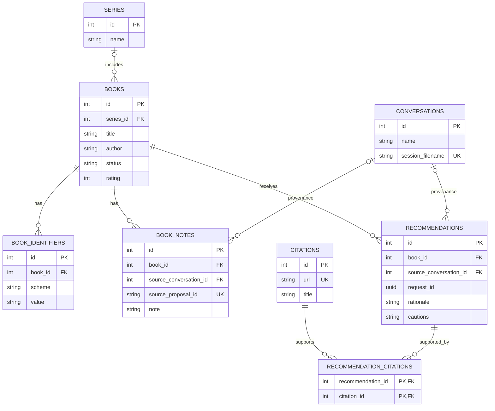

# Book Explorer Design

**Status:** Refined

## Purpose

Book Explorer is a single-user local web application for the kind of iterative book-recommendation discussion demonstrated in the “Frontlines RPG Potential” ChatGPT conversation. It preserves reading history, recommendations, and nuanced book-specific reactions across conversations while using a hosted model and live web research.

The first version proves one thing: a local application can provide a ChatGPT-like recommendation conversation while reliably retaining the user's book history and preferences.

## Goals

- Run as a lightweight local website, not a hosted service.
- Support multiple named conversations sharing one library.
- Reuse the user's existing Pi Codex OAuth authentication.
- Search the live web and retain citations for recommendation claims.
- Track works, series, recommendation history, reading state, optional 1–5 ratings, and nuanced notes.
- Let the assistant create recommendations automatically while requiring approval for anything that claims to represent the user's opinion.
- Keep book-domain state in local SQLite and conversation history in Pi's native JSONL sessions under Book Explorer's private data directory.

## Non-goals for Version 1

- General-purpose assistant behavior.
- A hosted site, user accounts, remote access, or multi-user support.
- S3 synchronization or backup.
- Edition, format, ownership, lending, Libby, Hoopla, or Kindle Unlimited tracking.
- Goodreads or StoryGraph import before their exports have been evaluated.
- Shared cross-book taste summaries, structured facets, embeddings, vector search, collaborative filtering, learned ranking, or graph visualization.
- Autonomous background work, messaging channels, scheduling, or NanoClaw integration.
- Mobile-specific UI work.

## Architecture

One Node 24 LTS TypeScript process binds to `127.0.0.1` and serves the browser application and its API. Version 1 requires Node 24.15 or newer so `node:sqlite` has its release-candidate API. The project records its Node version and exact dependency versions in source control; `node:sqlite` access is confined to the database module because the API has not reached stable status.

The process uses:

- `@earendil-works/pi-coding-agent@0.84.2` for the agent loop, streaming, compaction, model selection, and OAuth-backed Codex access.
- `pi-web-access@0.24.2` as an explicitly loaded Pi extension, pinned by the project lockfile, for Codex-backed `web_search` and returned citations. This version's `openai-search.ts` resolves `openai-codex` credentials through Pi's model registry.
- Node's `node:http` server and server-sent events for response streaming.
- Node's synchronous `DatabaseSync` API from `node:sqlite` for persistence.
- Static HTML, CSS, and browser JavaScript with no frontend framework or frontend bundler.
- TypeScript compiled to ESM JavaScript with `tsc` before execution.
- Node's built-in test runner.

Application data lives under `$XDG_DATA_HOME/book-explorer/` or `~/.local/share/book-explorer/` when `XDG_DATA_HOME` is unset. On POSIX, startup creates and verifies the application directory, `sessions/`, and cache directories as mode `0700`, and the database, JSONL sessions, configuration, models store, and cache files as `0600`; unsafe permissions fail startup with a corrective message. The process sets restrictive modes at creation time, and any atomic replacement uses a same-directory temporary file created as `0600` before rename. A new SQLite file is pre-created as `0600` before `DatabaseSync` opens it; after WAL is enabled, startup sets the live `-wal` and `-shm` side files to `0600` and verifies those modes. On Windows, files remain under the current user's profile and inherit its ACL, with a warning if the directory is broadly accessible.

SQLite is authoritative for books and related application state. Pi's native JSONL format is authoritative for conversation history. Each conversation owns one session file in Book Explorer's dedicated `sessions/` directory. SQLite stores only its generated relative filename and display metadata. Before opening a session, the application rejects absolute paths and `..` segments, resolves both the sessions directory and candidate through `realpath`, and verifies the candidate remains beneath the real sessions directory so symlinks cannot escape the boundary.

The process owns exactly one `SessionManager` instance per conversation in a registry. Conversation creation first calls `SessionManager.create(appCwd, appSessionDir)`, obtains `getSessionFile()` and `getHeader()`, creates that file exclusively as `0600` containing the header JSON plus newline, and calls `setSessionFile()` on the same manager so Pi marks the session flushed. Only then does it transactionally insert the SQLite conversation row and publish the manager in the registry. If the row insert fails, it removes the header file; if the process crashes between file and row, startup's orphan sweep removes it. An exclusive-create collision returns a visible create error without inserting a row. For an existing conversation it uses `SessionManager.open(checkedSessionPath, appSessionDir, appCwd)`. Transcript reads and every JSONL append for that conversation use the registered instance and a per-conversation FIFO mutex so two managers or concurrent appends can never fork the branch. Entries remain registered until conversation deletion or process shutdown; archival does not evict them. Deletion returns conflict while a turn or append is active. Under the conversation's FIFO mutex it marks the conversation ID as deleting, evicts the registry entry, atomically renames the JSONL file to a same-directory `.deleting` tombstone, deletes the SQLite row, then unlinks the tombstone. Every acquisition and append rechecks the deleting marker and registry identity inside that mutex, so no manager can append after eviction; the marker is cleared only after success or in-process rollback. At startup, a tombstone whose conversation row remains is restored to its recorded filename; a tombstone or ordinary session file with no referencing row is removed. A conversation row whose recorded session file is missing or unparseable fails startup with a corrective data-recovery message rather than silently creating empty history. Pi's tolerated partial trailing JSONL line remains recoverable through its native loader. This makes either deletion crash window recoverable without silently losing an existing conversation. Pi normally defers a new session's disk creation until its first assistant message; the header materialization above deliberately activates immediate persistence. A Pi `AgentSession` and fresh resource loader exist only for one model turn, but the passed long-lived, flushed `SessionManager` writes messages, tool results, custom entries, failures, and compactions directly to that conversation's JSONL file. The UI reads the active branch through the SessionManager APIs. Book Explorer does not duplicate messages in SQLite or reimplement Pi restoration, compaction, or session-entry migration. Images and user-visible branching are not supported in version 1.

The application awaits `ModelRuntime.create` with `authPath` explicitly set to Pi's existing `~/.pi/agent/auth.json`, `modelsPath` set to a validated application-local file, `modelsStorePath` set under Book Explorer's data directory, and `refreshOnCreate: false`. Missing, expired, or non-OAuth `openai-codex` credentials fail startup with a corrective message. Unless `PI_OFFLINE` is `1`, `true`, or `yes` (case-insensitive), matching Pi's offline convention, the application then calls `runtime.refresh({ allowNetwork: true, providers: ["openai-codex"], signal })` with its own 10-second abort signal and inspects the result's `aborted` flag and `errors` map. A successful refresh resolves the conversational model explicitly as `openai-codex/gpt-5.6-sol` with medium thinking. An offline start, aborted refresh, provider error, or unavailable model starts the local library but marks model turns unavailable with a visible restart-required error; it never silently uses the built-in catalog or another model. It passes that exact model and runtime instance to every agent session and guard. `agentDir`, `SettingsManager`, extension configuration, model cache, sessions, and all other application paths also remain under Book Explorer's data directory. Setting an application-specific `agentDir` alone is insufficient and must not be used as the authentication mechanism.

Each model turn constructs a fresh `DefaultResourceLoader` configured with `noExtensions`, `noSkills`, and `noContextFiles`, `systemPromptOverride: () => completePrompt`, and `appendSystemPromptOverride: () => []`, then awaits `loader.reload()` before session creation. The project-local `pi-web-access` extension entry point is the only `additionalExtensionPaths` entry. A loader is never reused after its session is disposed because disposal invalidates the session's extension runner; a fresh loader gives the next session a fresh runner while the cached extension module remains process-wide. Six application tools are registered through `customTools`, plus the extension's `web_search`;  an inline `extensionFactories` guard handles the `tool_call` event and blocks forbidden search parameters. Each tool returns `{ ok: true, data: ... }` or `{ ok: false, error: { code, message, retryable } }`; validation errors never enter a transaction. `createAgentSession` uses `noTools: "builtin"` and an explicit allowlist containing those six tools plus `web_search`:

- `search_library`
- `get_book`
- `upsert_book`
- `upsert_series`
- `record_recommendation`
- `propose_change`
- `web_search`

These constants are the complete `tools` allowlist. Their input schemas are:

- `search_library`: optional `query` (200 characters), `status`, `rating`, `seriesId`, `limit` (1–50, default 20), and `offset` (non-negative, default 0); returns matching book summaries and total count.
- `get_book`: required positive integer `bookId`; returns the complete work, identifiers, notes, recommendations, and citations or `not_found`.
- `upsert_book`: required `title` and `author` (1–300 characters each); optional `publicationYear` (integer 0–9999), HTTP(S) `coverUrl`, positive `seriesId`, `seriesPosition` (40 characters), and at most 20 identifiers shaped as `{ scheme, value, source }`; it may fill missing bibliographic fields but has no status, rating, or note inputs. It returns the created/found book plus ambiguous duplicate candidates and never merges candidates automatically.
- `upsert_series`: required `name` (1–200 characters) and optional `note` (2,000 characters); returns the created/found series.
- `record_recommendation`: required positive `bookId`, `rationale` (1–4,000 characters), optional `cautions` (2,000 characters), and at most 20 opaque `citationTokens`; request UUID comes only from the request closure. It returns the idempotent recommendation and linked citations.
- `propose_change`: required positive `bookId`, `kind` (`status`, `rating`, or `note`), matching `value` (reading-status enum, integer 1–5, or note text of 1–4,000 characters), `semanticSlot` (1–100 characters), and `explanation` (1–2,000 characters); request UUID comes only from the closure. It returns the deterministic proposal ID and existing/new state.

Schemas reject unknown properties. Identifier, URL, and normalized-name rules below are applied after structural validation. The application-local web-search config must exist and validate before loader creation because `pi-web-access` itself logs and replaces malformed config with defaults rather than failing closed. After `loader.reload()` and session creation, every turn inspects the active `session.state.tools` names before prompting and fails closed if the allowlist was omitted or any unexpected registered tool survived filtering. A startup probe uses and disposes its own loader rather than the first turn's loader. Coding, shell, filesystem editing, subagent, page-fetching, curator UI, and other Pi or `pi-web-access` tools are disabled.

The application-local `web-search.json` sets `provider: "openai"`, `openaiSearchProviders: ["openai-codex"]`, contains no `openaiApiKey`, `workflow: "none"`, and nested `tools.sourceCheck.enabled`, `tools.fetchContent.enabled`, and `tools.getSearchContent.enabled` to `false`. Before importing the extension, startup rejects an `openaiApiKey` config field and deletes `OPENAI_API_KEY` from this process environment; Book Explorer does not use that variable elsewhere. With both extension API-key sources absent, failure to resolve `openai-codex` OAuth produces a search error rather than a billable fallback. The headless extension runner is never bound to Pi dialog/TUI services, so curator mode remains unavailable. A small inline guard extension accepts omitted `provider`/`workflow` values (which resolve through the validated config) or the exact explicit values `provider: "openai"` and `workflow: "none"`; it blocks other values, `includeContent`, and provider arrays. The system prompt also tells the model to omit `includeContent`, never use provider arrays, and use only those pinned provider and workflow values so rejected calls are exceptional rather than routine. Before allowing the call, it uses the exact `ModelRuntime` passed to the session to verify an `openai-codex` model and OAuth credential; API-key and environment fallbacks do not satisfy this check. Otherwise it returns a visible search-unavailable error instead of letting `pi-web-access` choose a fallback. `PI_CODING_AGENT_DIR` is set before importing the extension, causing `pi-web-access@0.24.2` to place its configuration and any on-disk fetch cache under Book Explorer's application directory rather than the user's general Pi directory. `pi-web-access` module state is process-wide even though each agent session is ephemeral. Book Explorer therefore permits only one model turn globally, avoiding cross-conversation mutation of that extension state. Each complete search result is consumed during its request; only citations used by a saved recommendation are recorded in SQLite. The application removes any stale `web-search-cache` directory first at startup, then recreates and verifies it as `0700`; the guarded search path must not write files to it.

Pi's credential storage uses a cross-process file lock during OAuth refresh and mutation. Concurrent coding and Book Explorer sessions therefore do not share conversation state or corrupt credentials because both runtimes open the same auth path. They can still compete for account-level subscription rate and concurrency limits; the UI reports those errors directly.

## Data Model

SQLite enables foreign keys and WAL mode. The process owns one `DatabaseSync` handle. Every database operation and transaction is synchronous and contains no awaited work, so Node's event loop serializes writes from concurrent conversations; network calls occur outside transactions. Numbered migrations run transactionally at startup. A failed migration prevents startup rather than opening a partially migrated database.

### Core records

- `conversations`: name, generated relative Pi session filename, timestamps, and archival state.
- `series`: canonical name, a unique normalized-name key, and optional descriptive note.
- `books`: title, author text, normalized title and author candidate keys, publication year, cover URL, optional series and series position, reading status, optional integer rating from 1 through 5, and timestamps.
- `book_identifiers`: book, scheme (`openlibrary_work`, `isbn10`, or `isbn13`), normalized value, and source. A book may have many identifiers; `(scheme, value)` is unique.
- `book_notes`: book, note text, optional source conversation and proposal ID, and timestamp. Notes are append-only by default so changes in opinion remain visible; the user can edit or delete them explicitly.
- `recommendations`: book, optional source conversation, request UUID, rationale, cautions, and timestamp.
- `citations`: unique normalized URL, title, supporting snippet when available, observed search provider, and retrieval timestamp.
- `recommendation_citations`: recommendation and citation foreign keys identifying which researched sources support a recommendation.
- `open_library_cache`: Open Library work ID text primary key, validated successful metadata payload serialized as JSON, and retrieval timestamp. This cache is not an application entity and is the sole exception to integer application-entity keys. Successful entries remain fresh for 30 days; explicit user refresh bypasses and replaces them, and failures are not cached.

Proposed ratings, statuses, and book opinions are not SQLite records. These are the only version 1 proposal kinds, and each has a server-side schema. `propose_change` appends a Pi custom entry with `customType: "book-explorer-proposed-change"`, a deterministic proposal ID, kind, target book, validated payload, explanation, and request UUID. Proposal decisions use recoverable ordering across JSONL and SQLite. Acceptance validates the edited payload, appends a `book-explorer-proposal-decision` entry with state `applying`, transactionally updates `books` or inserts `book_notes`, then appends a terminal `accepted` entry. On restart, an `applying` entry without a terminal entry remains visible as completion-required; retry idempotently reapplies the SQLite effect and appends `accepted`. Rejection appends one terminal `rejected` entry and does not touch SQLite. The UI derives pending proposals by matching proposal and decision entries in the conversation JSONL.

All tables use explicit primary keys and application entities use integer primary keys. Names used for candidate matching are normalized with Unicode NFKC, `String.prototype.toLowerCase()`, trimming, and Unicode-whitespace collapse. `series.normalized_name` is unique; `(books.normalized_title, books.normalized_author)` is a non-unique candidate-search index and never causes an automatic merge. Deleting a conversation sets optional provenance links on book notes and recommendations to null, so it cannot erase library state. Deleting books and series is always an explicit user action. Book-owned identifiers, notes, recommendations, and recommendation-citation joins cascade when a book is deleted; deleting a series sets `books.series_id` to null and never deletes books. Unique constraints cover conversation session filename, `series.normalized_name`, `(book_identifiers.scheme, book_identifiers.value)`, normalized citation URL, `(recommendations.request_id, recommendations.book_id)`, and non-null proposal IDs on book notes. The first numbered migration contains the authoritative v1 DDL and is frozen by schema tests. The ERD below intentionally omits the non-entity `open_library_cache` table.

### Entity relationships

- A **book** is the central library record. Ratings and reading status live directly on it; opinions live in `book_notes`.
- A **recommendation** means the assistant recommended one book during a model request. It is saved immediately because it records assistant behavior, not the user's opinion.
- A **citation** exists only when a recommendation uses that researched source. The join table allows a recommendation to cite several sources and one source to support several recommendations.
- A **proposed change** is not a database entity. It is a structured conversation artifact in Pi JSONL until accepted. Acceptance writes the resulting user-owned state to `books` or `book_notes`.
- A **conversation** provides optional provenance for recommendations and accepted notes without duplicating individual chat turns in SQLite.
- Request lifecycle, failures, retries, tool calls, proposals, and proposal decisions remain in the Pi JSONL session, which is outside the ERD; `conversations.session_filename` maps to it.

### Reading status

A work has one of:

- `recommended`
- `interested`
- `reading`
- `read`
- `abandoned`
- `not_interested`

Rating is optional and constrained to integer values from 1 through 5.

### Identity and duplicates

The application tracks works, not editions. An Open Library work ID is the strongest work-level identifier when available. Inputs may be `OL123W` or `/works/OL123W` in any ASCII case and are stored as uppercase `OL123W`; other shapes are rejected. ISBN-10 and ISBN-13 values identify editions or formats, so a work may retain multiple ISBNs as lookup aliases and deduplication evidence; ISBN is never substituted for work identity. ISBNs are normalized without punctuation, preserve a valid ISBN-10 `X` check digit, and must pass their checksum before storage. Otherwise the application uses normalized title and author as a duplicate candidate, not as an unconditional identity. Citation URLs are normalized with the WHATWG `URL` parser: only HTTP(S) is accepted, the fragment is removed, host casing/default ports follow URL serialization, query pairs are sorted by name then value while retained, and the serialized pathname—including any trailing slash—is preserved. Conflicting or ambiguous identifiers are shown for manual resolution; the application never silently merges them.

Open Library lookup is application code, not an agent or `pi-web-access` tool. It uses `https://openlibrary.org` and `https://covers.openlibrary.org`, sends an identifying user agent, and places requests in one process-wide FIFO queue with at most one request in flight. A slow request therefore delays later metadata lookups but never holds a database transaction or blocks manual entry. The client caches successful work metadata in SQLite for 30 days, supports an explicit refresh that bypasses the cache, and does not perform bulk catalog retrieval. Cache payloads carry schema version `1`; another version is treated as a miss. A failed refresh retains but does not silently return the prior row: the API returns the stale metadata together with a visible refresh error so the user may keep or edit it. Open Library may supply work-level title, author, year, cover, series hints, and identifiers. Every metadata field remains editable, and timeout, rate-limit, malformed-response, or not-found errors do not prevent creating a work manually.

## Conversation and Agent Behavior

Before each model request, the server generates a request UUID, acquires the conversation's registered Pi `SessionManager`, and appends a `book-explorer-request` custom entry before prompting with the new user message. The request UUID is available to every custom tool through the request-scoped closure. An explicit retry reuses the original request UUID and appends a retry marker. Pi's native JSONL entries remain authoritative for message, tool-call, failure, cancellation, and retry history; none of this lifecycle state is duplicated in SQLite.

For each user turn, the server provides the agent with:

1. the conversation context restored natively from its Pi session;
2. tool access to relevant books, ratings, statuses, notes, recommendations, and web research.

The database, not the conversation context, is authoritative for library state. The agent queries it rather than relying on remembered prose.

The agent may automatically:

- create a work or series needed for an explicit recommendation;
- record a deliberate recommendation with rationale, cautions, and available citations;
- update assistant-owned recommendation metadata.

A mere mention of a title is not a recommendation. The agent must make a deliberate recommendation tool call. A newly recommended work defaults to `recommended`; this is assistant-owned provenance, not an inferred user reading status.

The agent may only propose, not directly apply:

- the user's reading status;
- a 1–5 rating;
- a note representing the user's opinion.

Each proposed-change custom entry appears in the approval queue and can be accepted, edited, or rejected. Acceptance applies the edited value transactionally and appends a decision entry. Rejection appends only the decision entry and leaves SQLite unchanged.

Idempotency is enforced where each result is stored rather than through a generic action ledger. Book and series upserts use their identifier/name uniqueness. `(request_id, book_id)` makes a repeated `record_recommendation` return the existing recommendation even if regenerated prose differs. Proposed-change IDs are derived from the request UUID, kind, normalized target, and semantic slot, so a repeated `propose_change` returns the existing JSONL proposal. Accepted book notes use the proposal ID as a unique source; repeated rating or status assignments are naturally harmless. Tool transactions commit immediately. If a later model step fails, completed effects remain visible and a retry finds those records or JSONL entries instead of creating duplicates.

There is no second extraction model or background analysis pass in version 1. The active conversational agent performs explicit tool calls during its response.

## Web Research and Citations

The agent uses the explicitly loaded `pi-web-access@0.24.2` extension when recommendations require discovery, current information, obscure-book verification, or factual support. Its OpenAI search implementation resolves the active `openai-codex` model and shared OAuth through Pi's model registry. Only `web_search` is exposed; search requests select its OpenAI provider and disable its optional curator workflow.

An inline `tool_result` hook runs immediately after each `web_search`. The system prompt states the pinned search constraints and requires search and citation-backed recommendation recording in separate tool rounds. If the model nevertheless issues them as parallel sibling calls, `record_recommendation` rejects the not-yet-captured IDs and the model must retry it after the search result arrives. It reads the in-memory `SessionManager.getEntries()` entry whose `type` is `custom`, `customType` is `web-search-results`, `data.type` is `search`, and `data.id` equals the tool result's `details.searchId`. That custom entry—not the formatted tool-result text—is the source of structured titles, URLs, snippets, and actual search-provider names. Search attribution `openai` is distinct from the credential-provider ID `openai-codex`. Every result must report search provider `openai`; any fallback-provider result is converted to an error result and not persisted.

For accepted results, the hook retains normalized structured citations in request-scoped memory, then returns replacement content that appends machine-readable opaque citation tokens while re-emitting the original tool-result details unchanged. `record_recommendation` accepts only tokens in that request-local captured set; unknown tokens or model-invented URLs are rejected. In one transaction it creates or finds the recommendation, upserts each cited URL row with the newest title, snippet, provider, and retrieval timestamp, then links them through `recommendation_citations`. Thus only sources actually used by saved recommendations enter SQLite. Search-result custom entries and extension-private details remain in Pi's native JSONL session. The UI ignores non-display custom entries and never assumes their process-local cache identifiers remain dereferenceable after restart.

If search is unavailable, the assistant must distinguish model-memory suggestions from researched claims and must not invent citations. Failure to retrieve metadata or a source is visible but does not erase an otherwise useful recommendation.

## Local Web Interface

The default screen is chat-focused:

- A left sidebar lists named conversations and links to the Library.
- The center streams conversation text, citations, and inline recommendation cards. All model text, notes, metadata, source titles, and snippets are rendered with DOM text nodes, never `innerHTML`. Citation links are created through DOM APIs only after parsing and allowlisting `https:` or `http:` URLs, and use `rel="noopener noreferrer"`. Cover image sources are parsed and restricted to the same `https:` or `http:` schemes before assignment, and images use `referrerPolicy = "no-referrer"`. Version 1 does not render arbitrary Markdown or HTML.
- A right drawer shows the current book or pending proposed changes.

Recommendation cards show title, author, series, rationale, cautions, current status, citations, and quick actions for `Interested`, `Reading`, `Not interested`, and `Open book`. These quick actions are direct user actions, not assistant inferences.

The Library view supports text search across title and author plus filtering by status, rating, and series. A work's editable view includes metadata, identifiers, series position, status, rating, notes, recommendation history, and citations.

Pending proposed changes are reconstructed from Pi JSONL and reviewed individually. Each supports accept, edit-and-accept, or reject. Version 1 does not include bulk approval.

## API and Streaming

The local API contract is:

| Method and path | Input | Success |
|---|---|---|
| `GET /api/conversations` | `archived` boolean query, `limit`/`offset` | `200` paged conversation summaries |
| `POST /api/conversations` | `{ name }` | `201` conversation |
| `GET /api/conversations/:id` | none | `200` metadata plus displayable active-branch transcript |
| `PATCH /api/conversations/:id` | `{ name }` | `200` conversation |
| `POST /api/conversations/:id/archive` | `{ archived }` | `200` conversation |
| `DELETE /api/conversations/:id` | none | `204`; `409` if active |
| `POST /api/conversations/:id/messages` | `{ text, retryRequestId? }` | `200 text/event-stream`; this submission owns the SSE response |
| `POST /api/requests/:requestId/cancel` | `{}` | `202` after matching the active request |
| `GET /api/books` | `query`, `status`, `rating`, `seriesId`, `limit`/`offset` | `200` paged book summaries |
| `POST /api/books` | editable bibliographic fields and identifiers | `201` book or `409 { error: { code: "ambiguous_book", message, retryable: false, details: { candidates } } }` |
| `GET /api/books/:id` | none | `200` complete book view |
| `PATCH /api/books/:id` | editable metadata, status, rating, and series fields | `200` book |
| `DELETE /api/books/:id` | none | `204` |
| `PATCH /api/books/:bookId/notes/:noteId` | `{ note }` | `200` note |
| `DELETE /api/books/:bookId/notes/:noteId` | none | `204` |
| `GET /api/books/:id/recommendations` | `limit`/`offset` | `200` paged recommendations with citations |
| `GET /api/series` | `query`, `limit`/`offset` | `200` paged series |
| `POST /api/series` | `{ name, note? }` | `201` series |
| `PATCH /api/series/:id` | `{ name?, note? }` | `200` series |
| `DELETE /api/series/:id` | none | `204`, setting member books' series to null |
| `POST /api/open-library/lookup` | one of `{ workId }`, `{ isbn }`, or `{ title, author }`, plus `refresh?` | `200` metadata/candidates, optionally with stale metadata and a refresh error; `404` not found |
| `GET /api/conversations/:id/proposals` | none | `200` pending/completion-required proposals |
| `POST /api/conversations/:id/proposals/:proposalId/accept` | `{ value }` | `200` accepted effect |
| `POST /api/conversations/:id/proposals/:proposalId/reject` | `{}` | `200` rejected decision |

List routes default to 20 rows, cap `limit` at 100, and return `{ items, total, limit, offset }`. JSON successes use the documented entity or `{ data: ... }`; errors uniformly use `{ error: { code, message, retryable, details? } }`, where `details` contains only safe structured remediation data such as duplicate candidates. Invalid input is `400`, CSRF/origin failure `403`, missing records `404`, state conflicts/global busy `409`, quota/rate limiting `429`, and unexpected failures `500`. All state-changing routes validate request bodies and use transactions. Every agent-facing custom tool also validates its arguments with a server-side schema that bounds string lengths, enforces enums and numeric ranges, and applies identifier and URL normalization before any database operation. At startup the server generates an unguessable per-process CSRF token, embeds it in the served application shell, and requires it in a custom header on every state-changing request. The cancellation route additionally requires the exact in-memory active request UUID, so a delayed cancellation cannot affect a later request. It also requires the configured loopback `Host`, an exact same-origin `Origin`, and a JSON content type where applicable. Missing or unexpected values are rejected. These controls prevent drive-by browser requests; they do not attempt to defend against another process running as the same operating-system user.

OAuth credentials and provider responses containing secrets are never sent to the browser or stored in SQLite application records.

Only one model turn may run in the process at a time. Direct user library edits and proposed-change decisions remain allowed while the model awaits network I/O because no database transaction spans an await. Agent metadata upserts fill missing bibliographic fields but never overwrite user-owned status, rating, or notes; user changes therefore win and become visible to subsequent tool reads. A second submission from any conversation receives a visible global-busy response rather than running concurrently. This is sufficient for one local user and prevents process-global extension state and subscription limits from coupling concurrent turns; concurrency is reconsidered only if actual use requires it. Pi stream events are mapped to a small browser event schema (`text_delta`, `tool_status`, `citation`, `complete`, and `error`). Error events contain a stable application code, retryable flag, and safe message; authentication, quota/429, concurrency, search, and internal failures are classified before streaming rather than inferred by the browser from text. The streaming response never emits cross-origin access headers. The server honors socket backpressure. On cancellation, disconnect, model error, tool error, or any other non-normal exit it awaits `session.abort()` until Pi is idle, then calls `session.dispose()`, and only then releases the global model gate. Normal completion also disposes the session before releasing that gate.

## Error Handling and Recovery

- Database open or migration failure prevents startup.
- Missing, expired, or non-OAuth Codex credentials prevent startup. Offline mode, catalog refresh failure, or an unavailable pinned model leaves library routes usable but rejects model turns with a stable restart-required error.
- A failed database tool action aborts that action and is reported to the agent and UI; there is no success-shaped fallback.
- A failed model request leaves its native Pi error/aborted entries in JSONL. An explicit retry reuses the original request UUID, so already-completed recommendations, upserts, and proposals are found through their own uniqueness rules.
- Partial assistant output uses Pi's native aborted/error message entry when available, is displayed as incomplete, and is not treated as a completed recommendation rationale.
- Authentication, quota, and concurrency failures are shown distinctly.
- Web-search failure produces a visible limitation and no fabricated source claims.
- Incomplete metadata remains editable rather than blocking work creation.

## Testing

Automated tests use temporary SQLite databases and cover:

- transactional migrations and migration failure;
- book and series creation, NFKC/lowercase/whitespace name keys, canonical Open Library work IDs, ISBN normalization and checksums, citation URL canonicalization, uniqueness, ambiguous duplicate handling, and series deletion setting book links to null;
- reading-status and 1–5 rating constraints;
- recommendation recording and citation linkage;
- JSONL proposed-change creation, deterministic deduplication, edited acceptance, rejection, crash interruption after `applying` and after SQLite commit, idempotent completion, and reconstruction after restart;
- approved library state excludes pending JSONL proposals;
- conversation-to-session mapping, file-before-row creation and orphan cleanup, exclusive-create failure, new-session header materialization as `0600`, immediate pre-assistant custom-entry durability, crash before first assistant output, missing/corrupt referenced-file startup failure, atomic registry acquisition, one registered `SessionManager` per conversation under concurrent turn/decision appends, registry persistence across archival, active-delete conflict, append/acquire rejection after delete marking, unused-conversation deletion, tombstone recovery across both delete crash windows, injected SQLite-delete failure after tombstone rename proving filename restoration, same-manager republication, deleting-marker clearance, and a successful later append, delete eviction/reopen, failed-request recovery, ephemeral-session disposal, conversation deletion nulling provenance, and isolation from Pi coding-session directories;
- Pi JSONL conversation → compaction → process restart → native resume → successful second compaction;
- explicit `openai-codex/gpt-5.6-sol` medium model selection, a stubbed or seeded model catalog for offline tests, fresh-store network catalog bootstrap, `PI_OFFLINE` `1`/`true`/`yes` handling, rejection of aborted or provider-error refresh results, catalog timeout/failure yielding library-only mode, and startup failure when OAuth is unavailable or invalid;
- exact tool input/output schemas, valid and invalid boundary cases, exact allowlisting, and a startup failure when the allowlist is absent or unexpected tools remain;
- rejection of `web_search.includeContent`, non-`none` workflows, provider arrays, unavailable Codex auth, non-OpenAI provider outcomes, config `openaiApiKey`, and any `OPENAI_API_KEY` fallback after environment scrubbing, plus prompt compliance that avoids forbidden search arguments and no fetch-cache writes;
- `PI_CODING_AGENT_DIR` initialization before extension import and session-path boundary checks;
- local idempotency constraints across failure, cancellation, and retry, including committed tool success followed by model failure;
- two distinct same-tool calls in one request plus a retry with changed free-form prose;
- two consecutive successful web-search turns using separate loaders in one process;
- global model-turn exclusion across two conversations, including every error/abort path followed immediately by another submission;
- direct user edits during a model turn without lost updates to user-owned fields;
- mid-request extraction of citations from correlated `web-search-results` custom entries, opaque-token injection into the model-visible tool result, transactional persistence with a recommendation, preservation of actual provider names, and rejection of fallback-provider outcomes or unknown/invented tokens and URLs;
- route-contract tests for every endpoint, pagination, duplicate-candidate error details, uniform errors, CSRF, Host, Origin, content-type, active-request cancellation ID, pre-created SQLite and WAL side-file modes, all other POSIX directory/file modes and atomic replacements, Windows broad-ACL warning behavior, transcript, archive/delete, note edit/delete, and Open Library refresh;
- safe rendering of malicious HTML, `javascript:` URLs, malformed links, and cover image sources/referrer policy;
- SSE completion, backpressure, cancellation, disconnect, structured quota errors, and incomplete-response marking;
- Open Library user-agent, FIFO single-flight rate limiting, frozen cache DDL, payload-version invalidation, 30-day freshness, explicit refresh, stale-row retention with visible refresh failure, and timeout, rate-limit, malformed-response, and not-found handling.

Agent-facing tests use a fake model/tool driver and assert actions and persisted effects rather than exact prose. A separate opt-in integration check verifies current Pi OAuth, Codex model access, `pi-web-access` search, citations, streaming, and a concurrent credential refresh alongside a Pi CLI process. Normal tests never require network access or consume subscription capacity.

## Future Improvements

Deferred ideas—including a shared taste profile, structured facets, importers, embeddings, graph exploration, availability checks, Bedrock, and S3 backup—are tracked separately in [`2026-08-29-book-explorer-future-improvements.md`](2026-08-29-book-explorer-future-improvements.md). They are not version 1 scaffolding.
